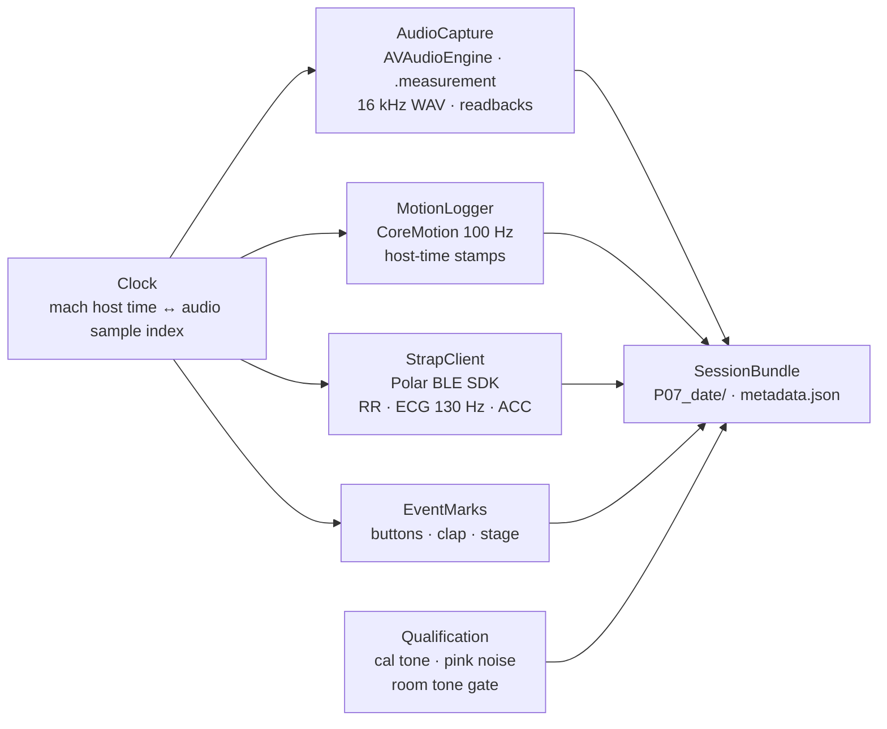

# Capture App Build Scaffold — bespoke iOS app, Polar SDK + IMU, initial-testing build

## For future Claude
The **build plan** for the team's own iOS capture app, scoped to the *initial-testing* build that Phase 0 needs (target Fri 09-25, Milestones): one iPhone records unprocessed 16 kHz audio, logs its IMU on the audio clock, ingests the Polar H10's RR intervals plus raw ECG and chest accelerometer, stamps events, and writes a session bundle in the Data Management Plan layout. This note is the scaffold — modules, clock strategy, SDK surface, build order, acceptance tests — **not the code**. The app ships in the graded repo (`capture/`), so the team writes it; Claude reviews structure, pressure-tests the clock and readback logic, and never authors submitted source. SDK-level claims in §4 were **checked 2026-09-22 against the SDK checkout** (Source - Polar BLE SDK, tag 8.3.0, submodule at `Sources/polar-ble-sdk/`); only firmware-offered stream settings remain `[VERIFY]` on the unit in hand. Written 2026-09-22 at Josh's request ("scaffold task"); card on Tasks.

---

## 1. Scope of the initial-testing build

**Must demonstrate** (the Phase 0 acceptance list, §7): unprocessed audio with readbacks · IMU on the same clock · H10 RR, ECG, ACC streaming into files · a clap that lands in audio, IMU and ECG · a qualification test that can fail loudly · a bundle that the Python QA script can open.

**Not in this build:** the model, on-device inference, the parity test's model half (only the feature-extractor half), Supabase or any upload, multi-phone orchestration (a second phone just runs the same app), Android.

**Ground rules that bind the code:** OS audio effects disabled and *verified* (Audio-Derived Exercise Exertion Estimation §1–2) · never Bluetooth audio (the strap is BLE data, not audio — fine) · raw audio stays on the phone and the encrypted drive, never a cloud table (Sensing Requirements and Signal Conditioning Core Idea 7) · nothing in a filename or field carries a name (participant code only) · consent before any recording of a person who is not a team member testing their own device.

## 2. Module map

| Module | Does | Writes | Reads back and logs |
|---|---|---|---|
| **AudioCapture** | `AVAudioSession` `.record` + `.measurement`, voice processing off, preferred input pinned, preferred sample rate 16 000; input-node tap → ring buffer → WAV writer | `audio_A.wav` (16 kHz mono PCM16) | actual `sampleRate`, route, `isEchoCancelledInputAvailable`, mic mode, input gain — into `metadata.json`; any mismatch = hard stop, not a warning |
| **Clock** | one time base for everything: the audio tap's `AVAudioTime.hostTime` (mach ticks) converted to seconds, plus the running sample index | — | first-buffer host time + sample rate, so any host-time stamp maps to a sample index offline |
| **MotionLogger** | `CMMotionManager` raw accelerometer + gyroscope at 100 Hz (or `deviceMotion` for gravity-split); `CMLogItem.timestamp` is seconds since boot on the same mach clock `[VERIFY]` | `imu_A.csv` — host_time, ax, ay, az, gx, gy, gz | achieved rate, dropped samples |
| **StrapClient** | Polar BLE SDK 8.3.0: connect by device ID, `setLocalTime`, HR stream with RR intervals, then ECG and ACC online streams after `requestStreamSettings`; **stop streams before disconnect** | `h10_rr.csv` (arrival host_time, hr, rr_ms…) · `h10_ecg.csv` (arrival host_time, polar_timestamp, µV) · `h10_acc.csv` (arrival host_time, polar_timestamp, x, y, z) | firmware, battery, chosen ECG/ACC settings, reconnects |
| **EventMarks** | big buttons: *cal tone* · *room tone* · *clap* · *stage +1* · *bout start/end* · *recovery start* · *note* | `events.csv` — host_time, label | — |
| **Qualification** | plays nothing itself (the reference source is external); marks the three cal-tone levels and the pink-noise burst so the QA script can check linearity and gating; 10 s room tone at start | marks in `events.csv` | — |
| **SessionBundle** | creates `Pxx_YYYY-MM-DD/`, writes `metadata.json` from the setup screen (participant code, phone model, iOS, gain, distances, room temperature…), closes files cleanly on stop | the folder | bundle checksum list |

## 3. Clock strategy (the thing that decides whether the data is usable)

- **One master clock:** mach host time (what `AVAudioTime.hostTime`, `CMLogItem.timestamp`, and `ProcessInfo.systemUptime` all derive from `[VERIFY]` — confirm the three agree on one device before trusting it). Audio is anchored by *(host time of first buffer, sample rate)*; every other stream is stamped with host time at arrival.
- **The strap has its own clock.** Polar sample timestamps are device-side; BLE delivery is buffered and jittery (Ground Truth and Validation Core Idea 5). Log **both** the Polar timestamp and the phone arrival time; align offline with the **clap on the electrodes** (spike in audio, IMU, and ECG) — see Lab Session Runbook. Never trust arrival time alone for ECG; never trust Polar time alone for RR.
- **Phone clocks between two iPhones** are aligned the same way: same clap, each phone records it.

## 4. Polar SDK surface to use (verified 2026-09-22 against the 8.3.0 checkout — Source - Polar BLE SDK)

- Package: `polar-ble-sdk` (GitHub `polarofficial/polar-ble-sdk`), **tag 8.3.0**, iOS 14+, Xcode 13.2+ / Swift 5.5+; Swift Package Manager `.upToNextMajor(from: "8.3.0")` or CocoaPods `PolarBleSdk ~> 8.3.0`; dependencies SwiftProtobuf + Zip. **8.x is async/await** (`AsyncThrowingStream`), no RxSwift. Plist `NSBluetoothAlwaysUsageDescription`; Background Modes → *Uses Bluetooth LE accessories*. Local checkout: `Sources/polar-ble-sdk/` (submodule; `git submodule update --init` on the Mac).
- Features to enable at API creation: `.feature_hr`, `.feature_polar_online_streaming`, `.feature_device_info`, `.feature_battery_info`, `.feature_polar_device_time_setup` (for `setLocalTime`).
- **RR intervals:** `startHrStreaming(identifier)` → `PolarHrData` samples with `hr`, `rrsMs: [Int]`, `rrAvailable`, `contactStatus` — 1 Hz, **no per-sample timestamp** (stamp with phone arrival time). Same RR data as the standard BLE Heart Rate Measurement characteristic (0x2A37); the nRF Connect check on 09-23 confirms the flag before the SDK is involved.
- **ECG:** `startEcgStreaming(identifier, settings:)` → `(timeStamp: UInt64, voltage: Int32)` in µV at **130 Hz**. **ACC:** `startAccStreaming` → `(timeStamp, x, y, z)` in **mG, gravity included**, at 25 / 50 / 100 / 200 Hz, range 2 / 4 / 8 G. Get `settings` from `requestStreamSettings(identifier, feature:)`; pick 100 Hz / 4 G unless the firmware in hand offers otherwise `[VERIFY on the unit]`.
- **Timestamps:** ECG/ACC `timeStamp` = nanoseconds since **2000-01-01T00:00:00Z** (Unix offset 946 684 800 000 000 000 ns). The H10 **resets its clock when it shuts down** (~1 min off the strap with no BLE) → call `setLocalTime` at session start and log `getLocalTime` readback in `metadata.json`.
- **Teardown rule (known issue):** the app must **stop ECG/ACC streaming** before disconnecting or removing the sensor, or the H10 stays on until the battery is dead. The strap also drops BLE 45 s after leaving the body.
- **Fallback logger:** the SDK's own `examples/example-ios/polar-sensor-data-collector` (PSDC) streams every data type to `.txt` files — usable on 09-23 for the SDK half of the check if the bespoke app is not ready, and a reference implementation for StrapClient.
- **For the Mac-side build session:** the checkout ships `AGENTS.md` and `sources/iOS/AGENTS.md` — the vendor's instructions for coding agents (read the checkout, don't assume version specifics). Point Claude at them.
- Only **one** BLE client gets the H10's RR at a time (Sensing Requirements and Signal Conditioning count row); the KICKR Core's trainer app must run on a different device from the strap ingest (BLE split rule, Decision - Jude's Wahoo KICKR as the cycle ergometer).
- Keep Bluetooth for *data* only; audio never routes over BT (check the route readback every session).

## 5. Build order (adapted from the Lecture 6 recipe; Plan mode first, frontend second, backend never)

1. **Scope prompt (Plan mode):** *"Build an iOS research capture app called AudioRate Capture that records unprocessed 16 kHz microphone audio, logs the IMU on the audio clock, streams RR/ECG/ACC from a Polar H10 via the Polar BLE SDK, stamps events, and writes a session bundle to local storage. No accounts, no upload. Ask me clarification questions."* — the sample-app slot in Dong's template stays empty; there is no similar app to point at.
2. **AudioCapture + Clock first**, alone: record 60 s, read back sample rate, route, effect flags; hard-stop on any failure. Verify the WAV opens in Python at exactly 16 000 Hz.
3. **MotionLogger**: add IMU; clap; confirm the spike's host time matches the audio sample index within one IMU sample.
4. **StrapClient**: HR/RR first (matches the nRF Connect check), then ECG, then ACC; clap on the electrodes; confirm the ECG spike aligns to the audio clap after the offline offset.
5. **EventMarks + SessionBundle**: setup screen → recording screen with the buttons → stop → bundle on disk → AirDrop/Files export to the encrypted drive (no cloud).
6. **Qualification marks**: cal-tone × 3 levels, pink-noise burst, room tone — the Python QA script does the checking.
7. **Frontend polish last**, from a reference screenshot if wanted — Dong's "frontend first" is for consumer apps; here the instrument matters more than the look.

Repo: `capture/` in `github.com/cleanpxe/audio-rate`, with `features/` shared later for the parity test (Data Management Plan §6).

## 6. What the team decides (open)

- [ ] SwiftUI vs UIKit; minimum iOS across the three handsets (Decision - Handset roster three iPhones — models still ⬜)
- [ ] IMU rate (100 Hz default) and raw vs `deviceMotion`
- [ ] ECG/ACC settings actually offered by the H10 firmware in hand — `requestStreamSettings` output (record firmware on the equipment list)
- [ ] Use PSDC (the SDK's own collector app) for the 09-23 SDK check, or wait for StrapClient?
- [ ] Whether the second phone runs the same app or a bare recorder for the LODO copies
- [ ] Who owns the app (cards claimed by name — Decision - No distinct roles shared ownership)

## 7. Acceptance tests for "initial testing" (all pass = Phase 0 instrument done)

| # | Test | Pass |
|---|---|---|
| 1 | Readbacks | `sampleRate` = 16 000, route = built-in or wired, voice processing off, echo cancellation unavailable/off, mic mode Standard — all logged in `metadata.json` |
| 2 | Effect-disable failure | forcing an unsupported setting blocks recording with an error, not a warning |
| 3 | Cal-tone linearity | three levels 10 dB apart from the reference source recorded within ±1 dB of linear (AGC off) — QA script |
| 4 | Pink-noise gating | floor between bursts does not drop to digital silence; no spectral hole 1–4 kHz — QA script |
| 5 | IMU clock | clap spike in `imu_A.csv` within 10 ms of the audio spike |
| 6 | RR stream | `h10_rr.csv` has `rr_ms` on ≥ 95 % of packets at rest; rejection rate logged |
| 7 | ECG + ACC | continuous 130 Hz ECG and chosen-rate ACC for a 10 min recording without gaps > 1 s; electrode clap visible in ECG |
| 8 | Strap alignment | offline offset from the clap is stable (< 50 ms drift) across a 10 min recording |
| 9 | Bundle | folder opens in the Python QA script; every file present; no name anywhere |
| 10 | Two phones | both record the same clap; offset between them recoverable |

Results go to Results Ledger as the first `Experiment -` rows (instrument validation), and the per-handset readbacks into the data card.

## Connections

- Source - Polar BLE SDK (the checkout at `Sources/polar-ble-sdk/`; verified facts) · Audio-Derived Exercise Exertion Estimation §1–2 (capture rules), §4 (strap), §9 (deployment, parity) · Sensing Requirements and Signal Conditioning (ten questions; app route) · Data Management Plan §1 (bundle), §6 (repo) · Lab Session Runbook (the session this app runs) · Pipeline Input to Verdict (stage table downstream) · Milestones (Phase 0 target 09-25) · Decision - IMU logged by the capture app · Decision - Breathing-rate reference H10 first belt conditional · Decision - Handset roster three iPhones · Risk Register rows 8, 10, 11, 12 · Tasks
