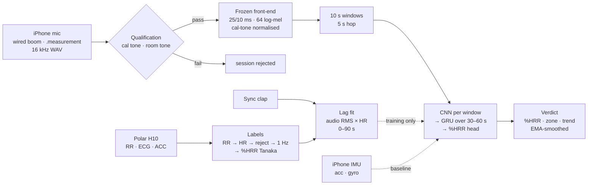

# Pipeline: Input to Verdict

**SE498 Team 3 "Audio Rate" · from microphone and strap to the zone on the phone · state as of 2026-09-16**

## For future Claude
The data flow of the decided system, stage by stage, for the team: what enters each stage, what leaves it, which decision fixed it, and what can silently fail. Distilled from Audio-Derived Exercise Exertion Estimation §1–9 and the 2026-09-16 ADRs; nothing here is new design. The training path and the on-device path share the frozen front-end — that parity is the central engineering rule. Zone thresholds are `[VERIFY]` (ACSM-style bands, no opened source). Companion: Lab Session Runbook (how the inputs are produced), Data Management Plan (where they live).

---

## The two paths

**Offline (training) path:** everything above, on a laptop, from session bundles. **On-device (verdict) path:** mic → qualification gate → frozen front-end → model → verdict, nothing uploaded. The strap, labels and lag fit exist only in the study.

## Stage table (what renders in the PDF)

| # | Stage | In | Out | Fixed by | Silent failure to watch |
|---|---|---|---|---|---|
| 1 | **Capture** | air near the mouth | 16 kHz WAV per phone; IMU CSV; readbacks | design note §1; Decision - Handset roster three iPhones; Decision - IMU logged by the capture app | OS noise suppression or AGC re-enabled by an update — level *is* signal |
| 2 | **Qualification gate** | cal tone, room tone | pass/fail per phone per session | design note §2 | a phone that passed last month fails today; checked every session |
| 3 | **Reference stream** | H10 over Polar SDK | RR intervals, raw ECG, chest ACC, timestamps | Decision - Breathing-rate reference H10 first belt conditional | dry electrodes at start; cadence-locked HR; only one device receives RR |
| 4 | **Sync** | clap in audio + RR artefact | per-phone offset to the strap clock | design note §3–4 | BLE jitter and clock drift of seconds corrupt the lag fit itself |
| 5 | **Labels** | RR intervals, resting HR, age | %HRR at 1 Hz, smoothed ~10 s; Tanaka HRmax | Decision - Protocol one session per participant age-predicted HRmax | training on raw BPM → model learns identity; HRmax scatter ± 7–11 bpm is a constant per-person scale error |
| 6 | **Lag fit** | audio RMS envelope (300–3000 Hz, 1 s) × HR | one lag per participant, 0–90 s | Decision - Labels by fitted lag continuous exertion trajectory | lag outside the window or a flat correlation peak (Risk 10) |
| 7 | **Windowing** | aligned audio + %HRR | 10 s windows, 5 s hop, label = mean %HRR; phase tag (ramp / steady / recovery); steady-state mask kept | same | windows straddling a stage transition without the phase tag |
| 8 | **Front-end** | window | 64 log-mel frames, 25 ms / 10 ms, floor-clamped, **normalised to the cal tone** | design note §6 | per-clip mean-variance normalisation (destroys level); app vs Python mel mismatch |
| 9 | **Model** | log-mel sequence, resting HR scalar | %HRR per window (+ breathing-rate auxiliary head) | design note §7 | a per-window CNN without context underfits the lagged, smooth label |
| 10 | **Evaluation** | predictions vs labels | LOPO MAE; **LODO MAE across three iPhone models**; MAE by ramp / steady / recovery; zone accuracy strict and ± 1; per-participant MAE; Bland–Altman; IMU-only and power-only baselines | Ground Truth and Validation; Proposal §4 | LODO collapse = learned the microphone; LOPO collapse = learned the person |
| 11 | **Verdict** | window predictions | %HRR, zone, recent trend; EMA-smoothed; Core ML int8 on the phone | design note §9 | quantised ≠ float; app ≠ Python on the same WAV — the file-injection parity test catches both |
| 12 | **Incremental validity** | Borg + differentiated ratings, HR, audio | within-subject mixed model, HR first, audio second | Decision - Target framing %HRR with incremental validity over HR | pooled correlations inflate; single-session RPE reliability is a stated limit (Risk 12) |

## From %HRR to a zone (verdict semantics)

| Zone | %HRR band `[VERIFY]` | Shown as |
|---|---|---|
| very light | < 30 | rest / warm-up |
| light | 30–39 | light |
| moderate | 40–59 | moderate — the rehab target band |
| vigorous | 60–89 | vigorous |
| near-maximal | ≥ 90 | back off |

The app shows the current zone and a 60 s trend arrow, never a heart-rate number: the claims fence (Goal Framing Boundary) says zone-level guidance, not an HR monitor. Zone accuracy is scored strict and with a ± 1-zone tolerance because the Tanaka denominator can shift a participant's whole scale (Ground Truth and Validation).

## Parity: the one rule that spans both paths

Same feature code, byte-identical parameters, in the training pipeline and the app. Verified three ways: numerical mel check against librosa on a fixed WAV; quantised-vs-float on test vectors; **file injection** — one WAV through the app and through Python must give the same prediction. Skipping this is the most common way live accuracy silently differs from offline accuracy (design note §6, §9).

## Build order

Phase 0 instrument (capture app, qualification test, H10 ingestion incl. SDK ECG/ACC, IMU, feature-extractor port + parity) → Phase 1 pilot session one (belt check, lag-fit check) → Phase 1 cohort (< 10) → Phase 2 offline QA + labels → Phase 3 training + evaluation → Phase 4 on-device + live validation with a strap-wearing participant. Dates in Milestones.

## Connections

- Audio-Derived Exercise Exertion Estimation · Audio Signal Processing and Features · Ground Truth and Validation · Lab Session Runbook · Data Management Plan · Milestones · Risk Register rows 8–12 · Results Ledger

